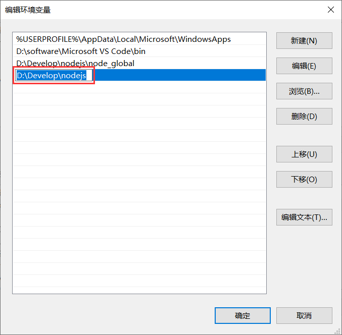

hexo 博客安装全过程（2022.05.25 更新）

<!-- more -->

> **注意:安装过程中 cmd 指命令提示符 都用管理员身份打开，避免出现乱七八糟的权限问题！！！**

> 安装包
> NodejsLTS
> Git

#### nodejs 安装

---

1.双击安装包
.webp>)
2.Next
.webp>) 3.修改安装目录为

```
D:\Develop\nodejs\
```

.webp>)
4.Next
.webp>)
5.Next
.webp>)
6.Install
.webp>)
7.Finish
.webp>) 8.打开命令提示符 cmd
.webp>) 9.分别输入以下指令检测是否安装成功

```
node -v
```

```
npm -v
```

.webp>) 10.进入安装目录
.webp>) 11.在 nodejs 文件夹内创建两个以下名称的文件夹

```
node_global
node_cache
```

.webp>) 12.创建完成后打开 cmd 指令分别输入以下两条指令

```
npm config set prefix "D:\Develop\nodejs\node_global"
npm config set cache "D:\Develop\nodejs\node_cache"
```

.webp>) 13.配置环境变量，“我的电脑 ➡ 右键 ➡ 属性 ➡ 高级系统设置 ➡ 高级 ➡ 环境变量”
.webp>) 14.用户变量下的 path 修改为

```
D:\Develop\nodejs\node_global
```

.webp>)
.webp>)
.webp>) 15.新建一个系统变量名称为

```
NODE_PATH
```

变量值为

```
D:\Develop\nodejs\node_global\node_modules
```

.webp>)

#### git 安装

---

1.打开安装包，next 2.选择安装目录(目录在哪无所谓，本人多少有点大冰，新建太多文件夹难受，所以就都放在 Develop 文件夹,当然,你随意)

3.Next 直到结束
4.Finish 安装完成

#### 通过 ssh keys 绑定 GitHub

1.注册 GitHub
提示填啥就填啥，注册个账户 2.登录进去以后，点击 new，新建一个仓库

存储库名称格式必须为

```
"username".github.io
```

> "username"是自己的 github 用户名

 3.打开 cmd，执行以下指令生成 ssh key

```
ssh-keygen -t rsa -C "username@email.com"
```

> "username@email.com"是 github 账户绑定的邮箱

回车直到生成
密钥生成的目录为

```
C:\Users\"username"\.ssh
```

 4.通过记事本或者编辑器打开
摁下[ctrl + a]全选，复制
打开 GitHub 并登录，点击头像 ➡Settings➡SSH and GPG keys➡New SSH key
 5.绑定 ssh keys

> title 随便写
> Key 将刚才复制的密钥粘贴进去
> 点击 Add SSH Key

6.在命令提示符 cmd 中原封不动输入以下指令

```
ssh -T git@github.com
```

若回复为 Hi "你的 GitHub 用户名"则为绑定成功


#### hexo 安装

1.以管理员身份打开 cmd，执行 hexo 全局安装指令

```
npm install hexo-cli -g
```

> 欸，不出意外的话有可能是要报错了
> 这里会提示'npm 不是内部或者外部命令'
> 解决方案
> 打开系统变量 → 用户变量
> 添加 nodejs 的安装目录`D:\Develop\nodejs` > 

2.输入以下指令检测 hexo 是否安装成功

```
hexo -v
```

3.在 D 盘新建一个[blog]文件夹,并进入 4.在 blog 文件夹下，右键 ➡Git Bash Here,进入命令行工具
 5.输入初始化命令，这里一般会出现两种情况

```
hexo init
```

> **第一种情况** 它提示执行`npm install`,这里我们去 C 盘删掉图上的文件`.npmrc`


> **第二种情况** 一般来说，除了提示`npm install`的情况,其他的大概率是网络问题
> 解决方案 1：清除缓存，多试几次
> 解决方案 2：用"科学"或者"魔法"


6.以下为初始化成功提示
 7.打开 blog 文件夹下的"\_config.yml"hexo 配置文件，拉到最底部

```
deploy:
  type: git
  repo: git@github.com:0god23/0god23.github.io.git
  branch: main
```

> ": "后边均有一个空格，请不要删除

> repo: 请修改为自己创建的 GitHub 仓库的 ssh url 克隆链接
> 如图
> 

8.执行`hexo g`生成本地静态文件
 9.执行以下命令安装 hexo-deplayer-git 依赖

```
npm install hexo-deployer-git --save
```

这里有很大概率会出一个小问题，他会提示你验证 github，按照下面指令修改执行就可以

```
git config --global user.name "Your Name"
git config --global user.email "you@example.com"
```

> "Your Name"是自己的用户名
> "you@example_com"是 github 绑定的邮箱

10.执行`hexo d`部署到 GitHub 仓库，这里会有一个弹窗提示登陆 github 账号，登录即可
 11.稍等几分钟即可部署生效
访如下网址

```
username.github.io
```

> "username"是自己 github 的用户名

# ~~end~~
