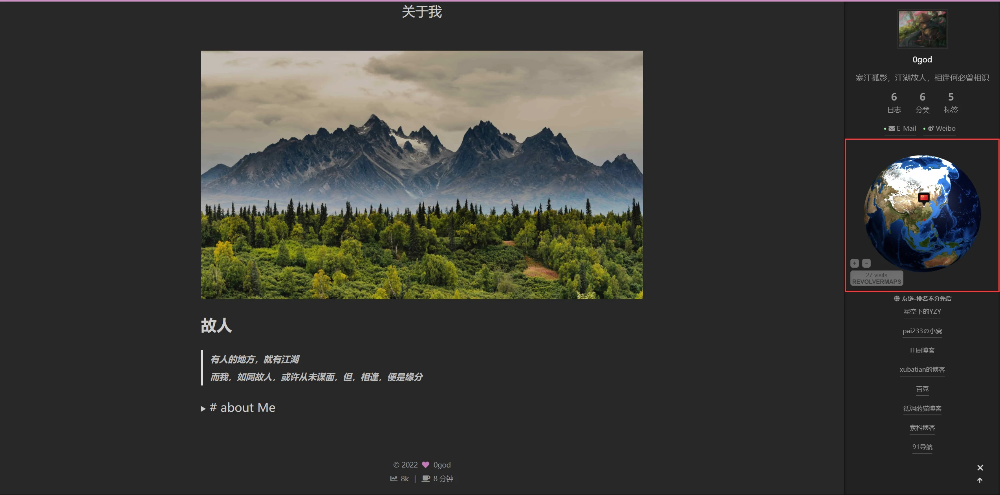
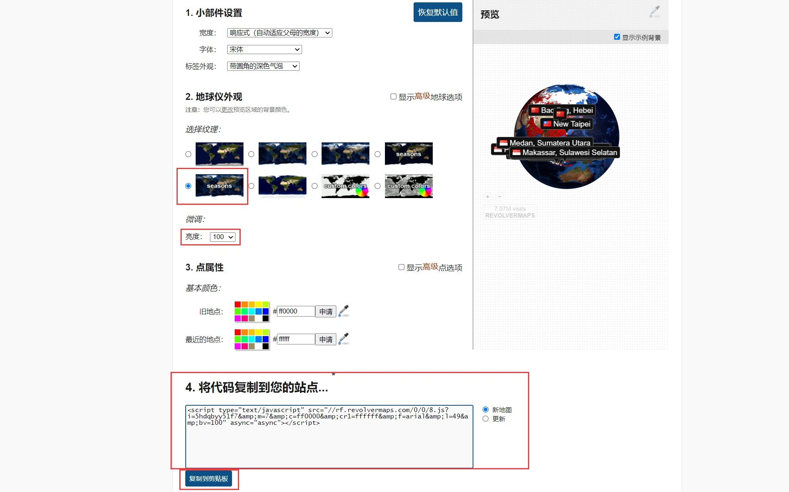

RevolverMaps 3D地球仪小组件
<!-- more -->

>RevolverMaps是一个免费的3D地球的小部件
官方的描述是：
RevolverMaps Standard GL 显示访问者的位置以及从安装到您的站点时的访问次数。最近的访问者位置被动画和标记，新的访问者位置出现在地球上。单击小部件底部的按钮可打开公共实时统计页面，提供有关访问者的详细信息。
将这个小部件安装到我们的博客还是蛮好看的，所以我这篇文章记录一下NexT主题在侧边栏添加RevolverMaps

首先我们访问[RevolverMaps](https://www.revolvermaps.com/?target=setupgl)官网生成代码

插件外观方面按需设置即可，默认也可以
设置完成后，我们点击copy to clipboard按钮(最下面的复制到剪贴板)
打开主题下的site-overview.njk文件路径为<code>blog\themes\next\layout\_partials\sidebar\site-overview.njk</code>
翻到最底部代码为
```
{# Blogroll #}

  <div class="links-of-blogroll site-overview-item animated">
    <div class="links-of-blogroll-title">
      <i class="{{ theme.links_settings.icon }} fa-fw"></i>
      {{ theme.links_settings.title }}
    </div>
    <ul class="links-of-blogroll-list">
      
        <li class="links-of-blogroll-item">
          {{ next_url(blogrollURL, blogrollText, {title: blogrollURL}) }}
        </li>
      
    </ul>
  </div>

```
我们在<code></code>代码下面一行添加一个<code>div</code>标签,将我们刚才复制的小部件代码添加到<code>div</code>标签里即可
```
{# Blogroll #}

//在这里↓
  <div>
    <script type="text/javascript" src="//rf.revolvermaps.com/0/0/8.js?i=5le2h1hfo8g&amp;m=7&amp;c=ff0000&amp;cr1=ffffff&amp;f=arial&amp;l=49&amp;bv=100&amp;rs=100&amp;as=100" async="async"></script>
  </div>
  <div class="links-of-blogroll site-overview-item animated">
    <div class="links-of-blogroll-title">
      <i class="{{ theme.links_settings.icon }} fa-fw"></i>
      {{ theme.links_settings.title }}
    </div>
    <ul class="links-of-blogroll-list">
      
        <li class="links-of-blogroll-item">
          {{ next_url(blogrollURL, blogrollText, {title: blogrollURL}) }}
        </li>
      
    </ul>
  </div>

```
end