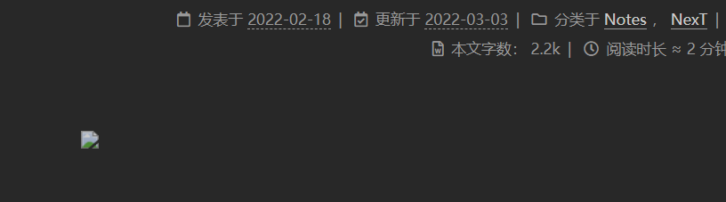

**abbrlink 导致图片无法显示**

<!-- more -->

在 hexo 里我们引入图片都是用 hexo-asset-image 插件，但单独使用是没有问题的，
如果遇到标题包含中文的情况下我们复制文章链接会变成一堆很长的编码，
这时候我们就要用到 abbrlink 插件，
至于插件如何使用我就不多赘述了，看文档即可
当我们配置完成后，就会发现虽然文章链接确实没有问题了，但是图片却无法显示

我们打开 f12 查看会发现图片路径变成 <code>/.io//001.webp</code> 而实际路径应该是 <code>posts/:abbrlink/001.webp</code>

#### 解决方案(一)

> **适用于 <code>permalink: posts/:abbrlink/</code>方案**

打开<code>blog\node_modules\hexo-asset-image\index.js</code>文件

将其中第 24 行代码<code>var endPos = link.lastIndexOf('.');</code>
更改为<code>var endPos = link.length-1;</code>

重新<code>Git Bash Here</code>

```
hexo clean
hexo g
hexo d
```

#### 解决方案(二)

> **适用于 <code>permalink: posts/:abbrlink.html</code>方案**

打开<code>blog\node_modules\hexo-asset-image\index.js</code>文件

将其中第 24 行代码<code>var endPos = link.lastIndexOf('.');</code>
更改为<code>var endPos = link.length-5;</code>

重新<code>Git Bash Here</code>

```
hexo clean
hexo g
hexo d
```

> 参考链接[Github hexo-asset-image](https://github.com/xcodebuild/hexo-asset-image)
