#### Cloudreve

Cloudreve 可助你即刻构建出兼备自用或公用的网盘服务，通过多种存储策略的支持、虚拟文件系统等特性实现灵活的文件管理体验。

[Cloudreve 官网](https://cloudreve.org/)
[程序下载地址](https://github.com/cloudreve/Cloudreve/releases)

##### 部署流程

不论是宝塔部署还是直接运行步骤都是一样的，创建网站目录-设置反向代理-上传程序-给权限-配置数据库-配置进程守护

##### 创建网站并申请部署 ssl 证书

创建网站以及数据库

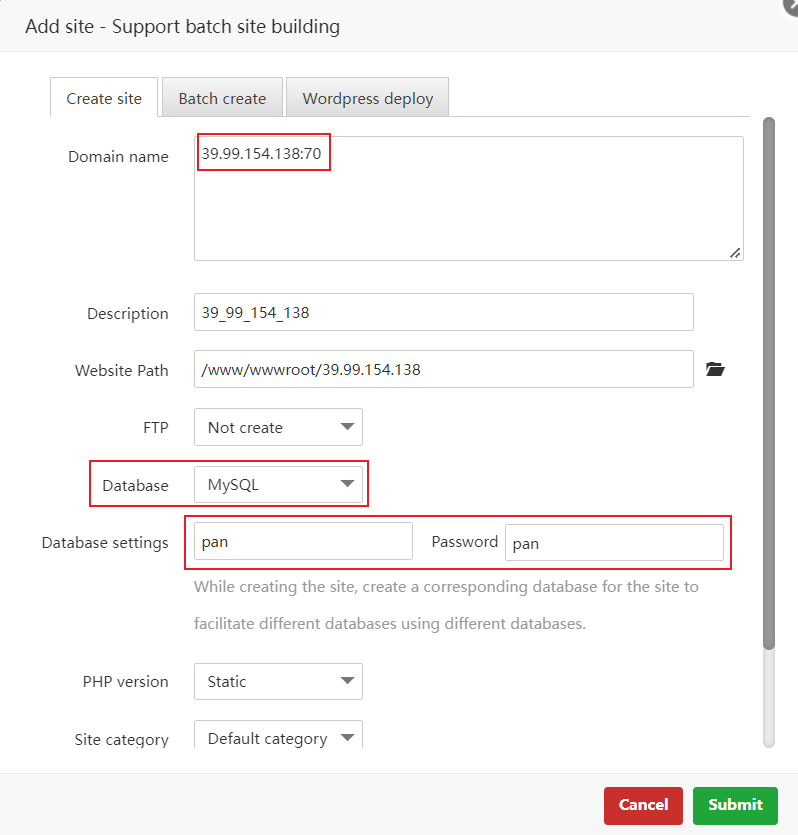
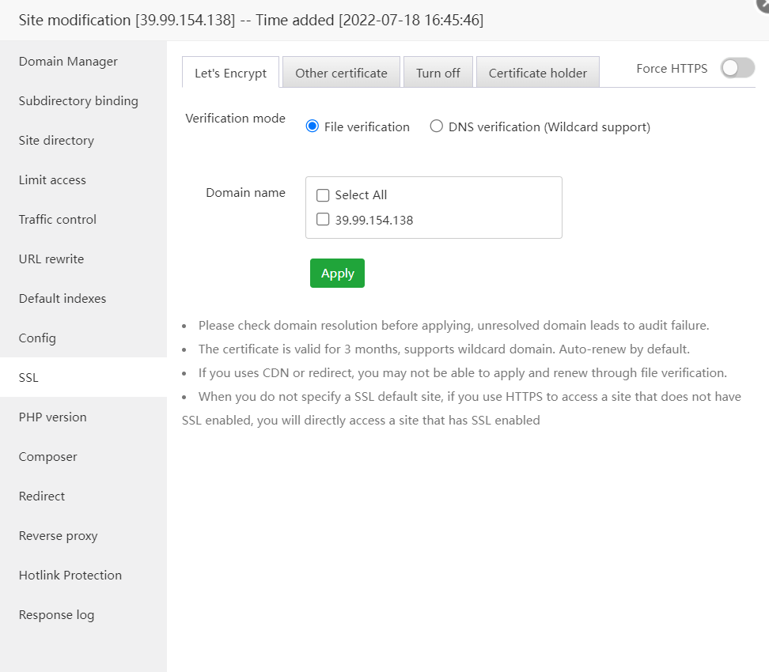

##### 设置反向代理

名称随意
目标 url:`http://127.0.0.1:5212`

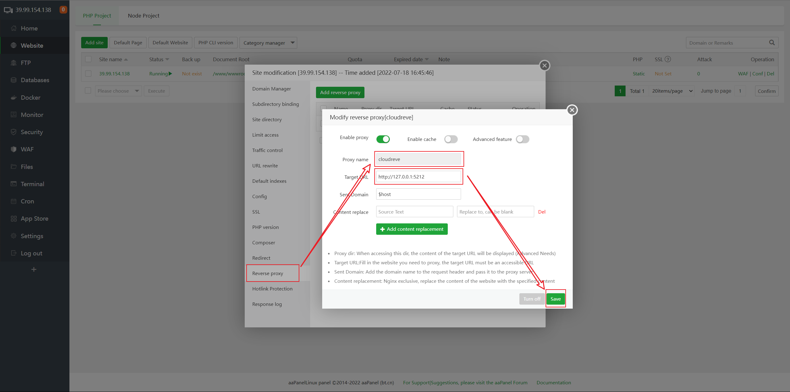

在这里我们要在宝塔放通 5212 端口，如果是大陆服务器可能还需要去安全组哪里放通此端口，否则会无法访问

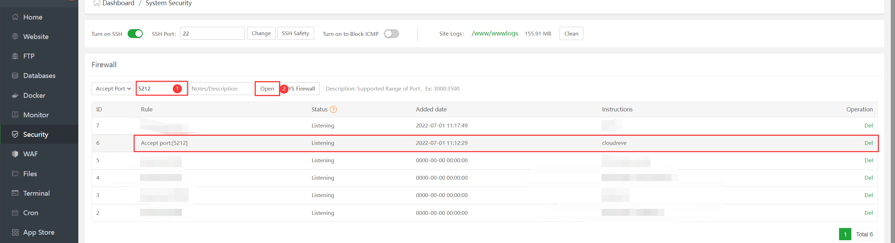

##### 上传程序

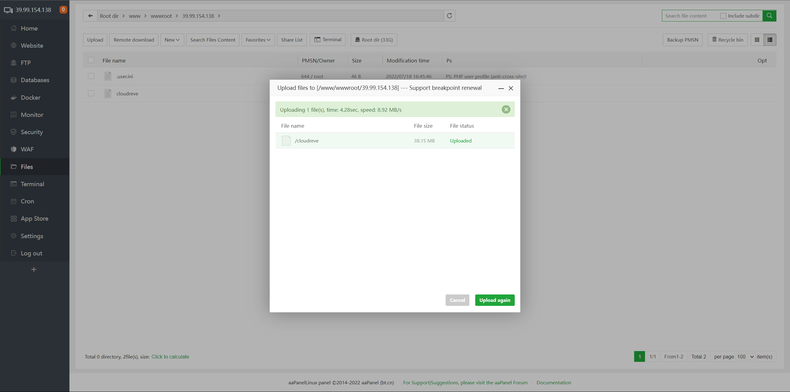

##### 给程序执行权限

用 ssh 工具 cd 到网站目录:`cd /www/wwwroot/网站目录`
给程序执行权限:`chmod +x ./cloudreve`

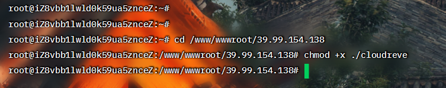

到这里我们其实是可以运行的，先运行一下看是否可以正常访问
继续在 ssh 工具里输入`./cloudreve`
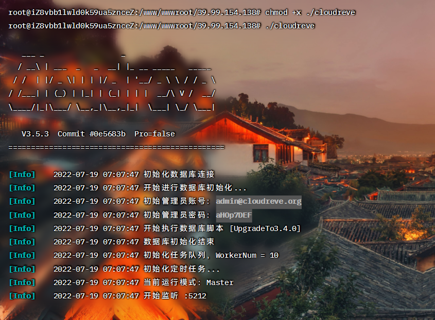
显示这样就已经成功了
由于 cloudreve 默认的是 SQLite，在生产环境中会出现一些问题，具体就不再细说，下一步我们需要把数据库切换为 mysql

##### 配置数据库

在 ssh 工具里 ctrl+c 把程序停止运行
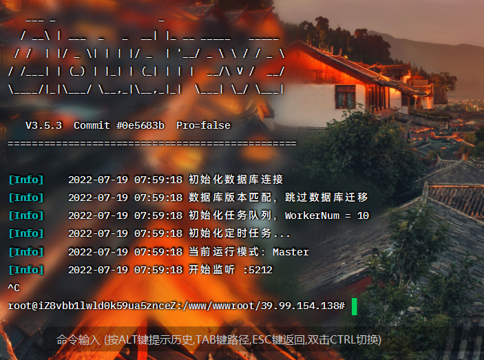
进入宝塔网站文件目录，删掉生成的 SqLite 数据库文件
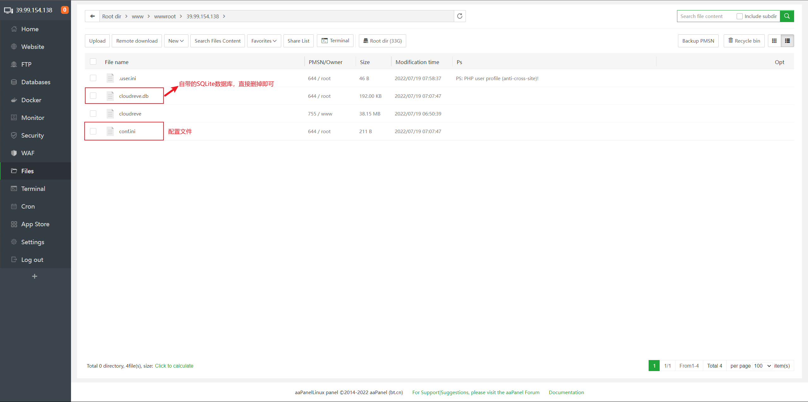
打开配置文件,如下图红框里的内容是自动生成的，红框外面的可以复制下面代码框的内容粘贴进去，其中`数据库用户名，数据库密码，数据库名`需要根据之前创建数据库时所设置的内容修改

```
[Database]
Type = mysql
Port = 3306
User = 数据库用户名
Password = 数据库密码
Host = 127.0.0.1
Name = 数据库名
TablePrefix = cd
Charset = utf8
```

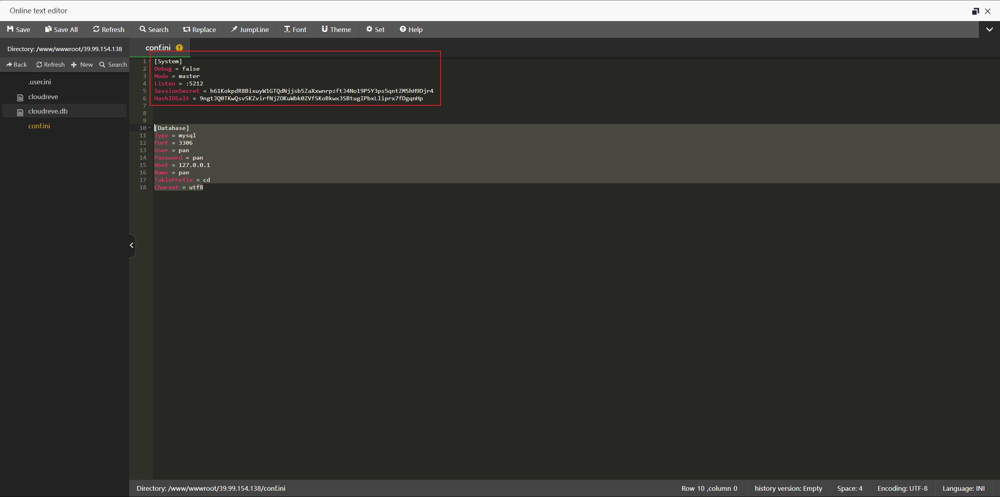

##### 进程守护

宝塔应用商店搜索`supervisor`安装并打开设置

`/www/wwwroot/网站目录/`
`/www/wwwroot/网站目录/cloudreve`
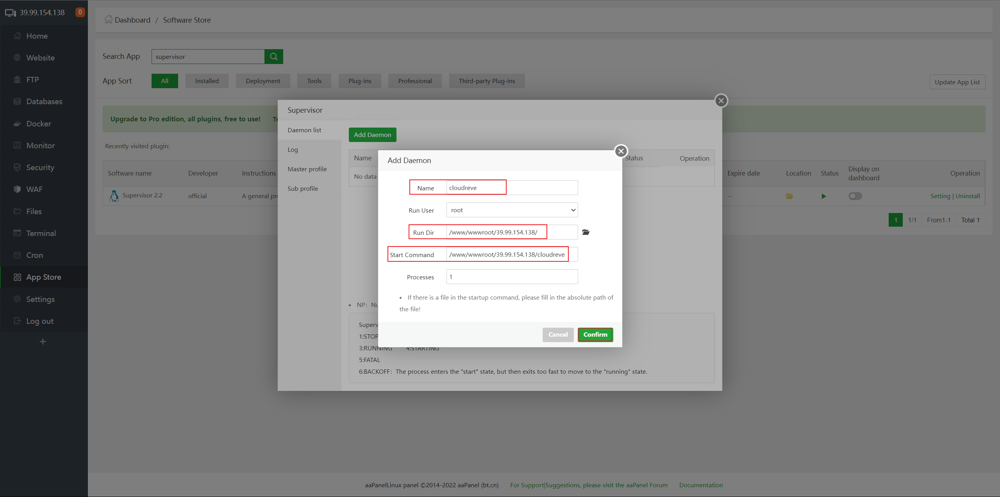
进程守护配置成功之后，点击左侧 log 查看管理员账号密码

##### 登录云盘

访问云盘地址，使用刚刚 log 里生成的管理员账号密码登录
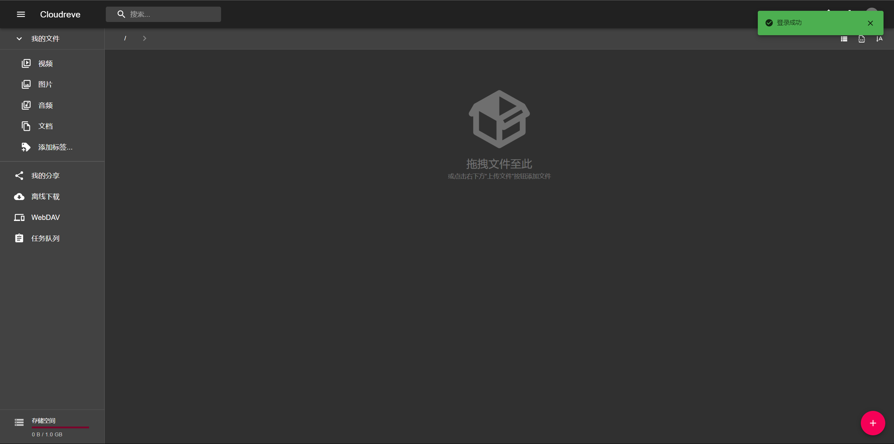

管理员账户密码后台自行设置
