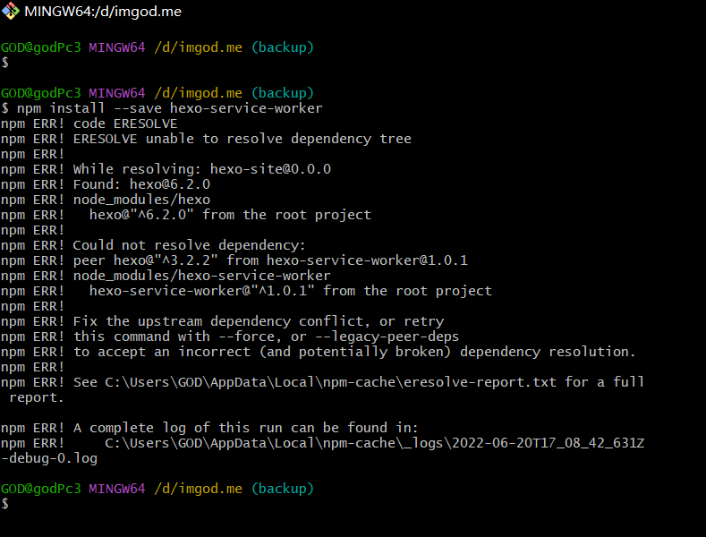
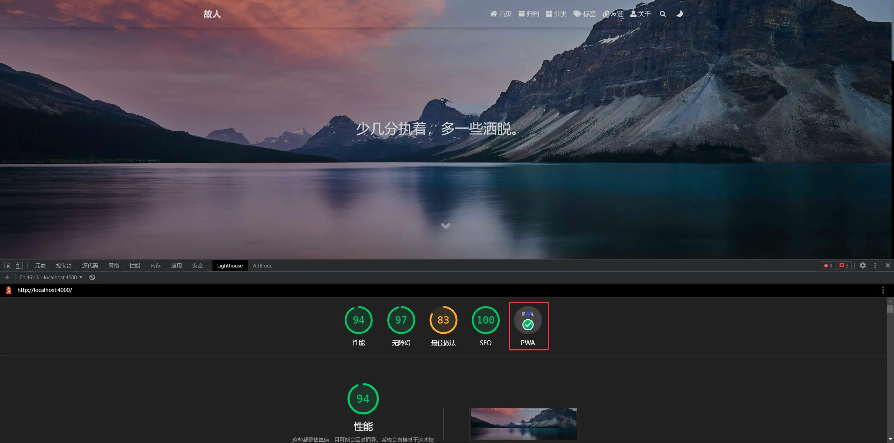

**先挂出参考地址:**

> [Hexo Theme Fluid](https://hexo.fluid-dev.com/posts/hexo-pwa)

> [吃白饭的休伯利安号](https://www.eatrice.cn/post/%E7%BB%99hexo%E5%8D%9A%E5%AE%A2%E6%B7%BB%E5%8A%A0PWA%E6%94%AF%E6%8C%81/)

本人参考的是 fluid 主题的文章，第二个是作者的原文，这两个地址写的教程也是完全一样的，随便参考哪个都可以

这里记录一下遇到的问题
最重要的就是 PWA 插件`hexo-service-worker`插件装不上

原因自行百度不做过多赘述

直接说**解决方案**

> 强制安装

`npm install --save hexo-service-worker --force`

其他配置参考文章开头链接即可

全部搞定以后`hexo s`浏览器 f12 找到 `lighthouse` 生成报告，如果没问题就会像下图显示的一样

还有一个小问题，开启 pwa 支持以后，不能直接`hexo d`(我为了省事有这个毛病，坏习惯)，必须先`hexo g`生成静态文件才可以`hexo d`,也可以`hexo g -d`

**end**
