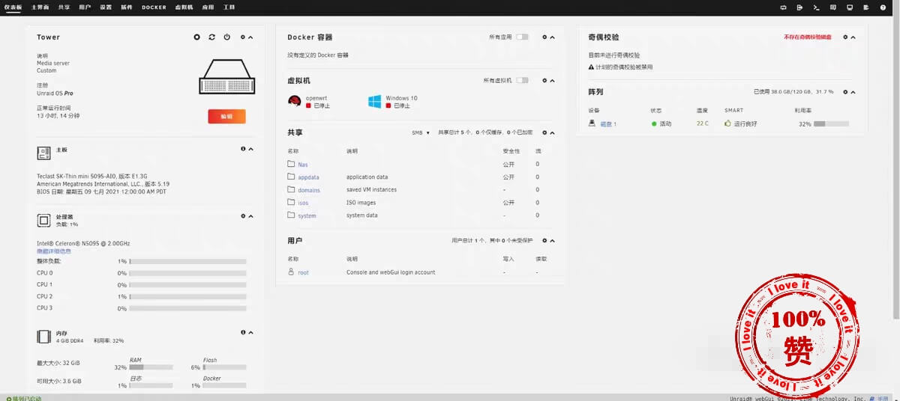
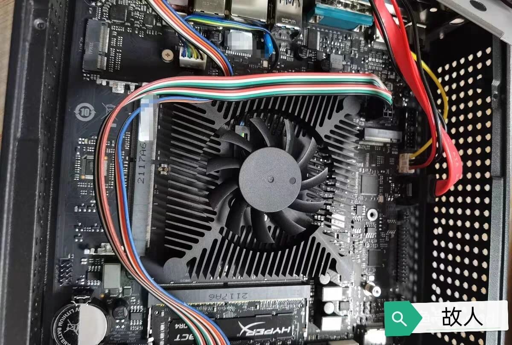

**通过虚拟软路由给unraid自身网络代理**
<!-- more -->

**我相信很多人知道unraid是因为b站的 [寂寞催眠师缩图](https://space.bilibili.com/28457) 安利的,但是呢，毕竟在gfw内部嘛，许多问题没办法直接百度找出来的**

---

#### 注意:

**填坑的前提是unraid已经安装好**

### 最主要的问题其实就网络问题，其他的问题自然而然就解决了（什么汉化、装插件等一堆乱七八糟的问题都包含在内）
那么有软路由的朋友我觉得应该不会遇到什么的问题，像我这种没有软路由的，就要考虑通过虚拟机软路由来给unraid自身代理

其实操作起来也不麻烦

> 1、关闭阵列，
2、打开设置里的网络设置，
3、**将unraid的网关和dns改为软路由的ip地址**
保存即可

v2或者酸酸乳在openwrt的大部分定制包里都可以用，[点击这里](https://god23812-my.sharepoint.com/:u:/g/personal/god_god23812_onmicrosoft_com/EanjomVCW3BGllCGObkT2XcBdurhslv61aSDvu1xnbCczw?e=nDwoqC
)下载我用的openwrt镜像

>补一句，自建和机场各有利弊，自建的缺点就是成本高、同价格速度慢、有被墙风险、小主机也有跑路风险，机场的缺点就是绝大部分不是原生ip、跑路的等等等等，不用听别人介绍自建一定好，没什么特殊需求买机场的就可以了，便宜速度还可以

---
**关于我个人对于nas的看法**
不要觉得nas很高级，nas其实就是个私人网盘，只不过能存点小视频什么的，不会被删东西而已，那么nas系统如群晖、威联通以及Unraid其实就是个定制化系统对于文件管理更友好而已，windows的此电脑管理文件也不差嘛，个人没需求就必要跟风买nas，那属于给自己创造需求，一定要确定自己的需求，按需消费，直接入正版nas费钱，但是diy不一定省钱，组装好以后吃灰的太多了，这点钱买点肘子吃不香么