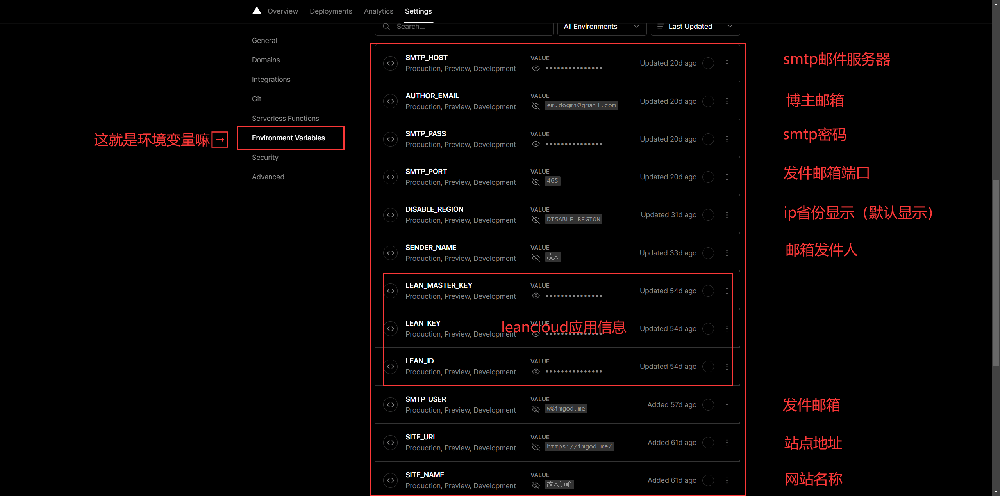

**[评论系统 waline](https://waline.js.org/)**

**安装**
**Ⅰ** 注册 [leancloud](https://console.leancloud.app/register)(尽量注册国际版，省掉很多麻烦事)
**Ⅱ** 注册 [vercel](https://vercel.com/)
**Ⅲ** [vercel](https://vercel.com/)部署
**Ⅳ** 配置环境变量`LEAN_ID`, `LEAN_KEY` 和 `LEAN_MASTER_KEY`
**Ⅴ** 重新部署
**Ⅵ** 引入博客(至于博客内部配置是看主题的，不同主题不同格式，搜文档就行)

```
  serverURL: 'xxx.imgod.me'
  path: window.location.pathname
  placeholder: 有问题请留言！
  meta: ['nick', 'mail', 'link']
  requiredMeta: ['nick','mail']
  lang: 'zh-CN'
  emoji: ['https://cdn.jsdelivr.net/gh/walinejs/emojis/weibo']
  dark: 'html[data-user-color-scheme="dark"]'
  avatar: 'retro'
  avatarCDN: 'https://seccdn.libravatar.org/avatar/'
  avatarForce: false
  wordLimit: 0
  pageSize: 10
  highlight: true
  copyright: false
```

> 以上是我 Fluid 主题的配置，可以参考一下

主要说环境变量哪里改
我以[邮箱通知](https://waline.js.org/guide/server/notification.html#%E9%82%AE%E4%BB%B6%E9%80%9A%E7%9F%A5)为例,
文档第一句话写的就是:邮件通知需要配置以下**环境变量**，
找到 waline 项目 设置-环境变量，参考文档添加就行



需要注意的是 waline 有一个 ip 属地显示的功能，文档好像是没有介绍怎么关闭，但提供了[关闭方法](https://github.com/walinejs/waline/issues/989#issuecomment-1116897998)，默认是开启的，我们可以照着下边设置来关闭,

```
NAME:DISABLE_REGION
VALUE:DISABLE_REGION
```

一通百通，其他的绝大部分参数修改方法是一样的
