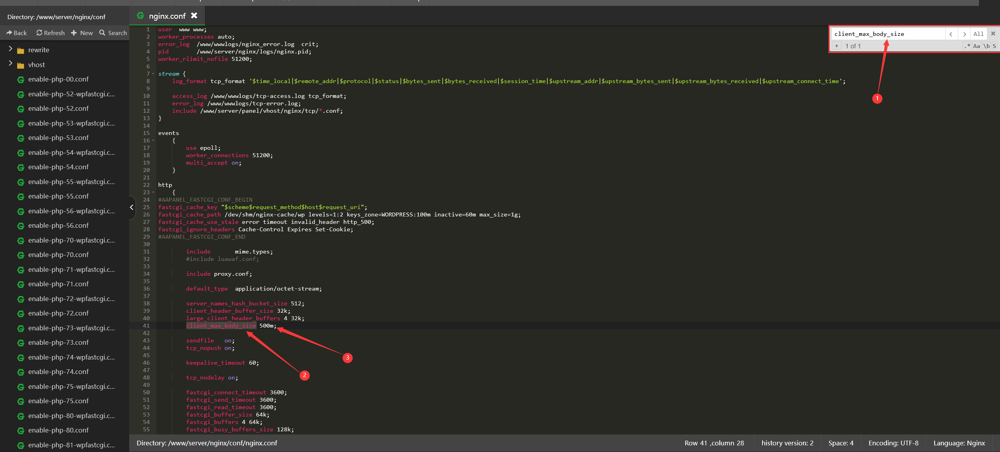
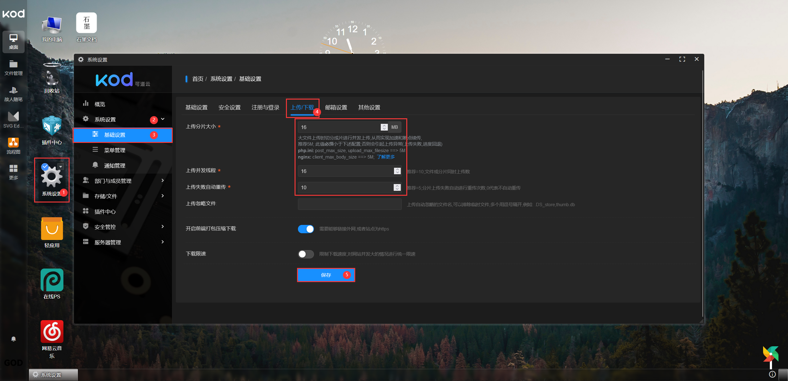

本来周日就准备写的，由于当时安装 kodbox（可道云）的时候没有截图，当天又传了很多文件，已经进入生产环境，不想重新安装，所以一直鸽到了现在，刚才找主机商要了一个测试机重新安装一遍才发出来

#### Kodbox

[kodbox(可道云)官网](https://www.kodcloud.com/)
[程序下载地址](https://kodcloud.com/download/)

**高效，流畅**
**云端存储&协同办公新体验**

> 如 Windows 体验的私有云盘/企业网盘

> 完全支持私有化部署，存储安全可控

> 数百种文件格式在线预览、编辑和播放

> 轻松分享，高效协作，细粒度权限管控

> 全平台客户端覆盖，随时随地访问，轻松同步挂载

### 安装

> **所需环境**
> Ubuntu 20.04
> Nginx 1.21.0
> MySQL 5.7.39
> PHP-7.4
> Redis 7.0.0

#### 新建网站

.png>)

#### 上传 kodbox 程序压缩包并解压

.png>)

#### 访问网站，这里提示`shell_exec/exec`两个函数未开启

.png>)

#### 进入宝塔应用商店，打开 php，点击禁用的功能，删除`shell_exec/exec`两个函数的禁用

.png>)

#### 重启 php

.png>)

#### 下一步

.png>)

#### 这里提示 redis 有问题

.png>)

#### 回到宝塔应用商店，安装 redis

.png>)

#### 打开 php，安装 php-redis 拓展

.png>)

#### 回到网站，填好数据库，选择 redis，确定

.png>)

#### 设置管理员密码

.png>)

#### 进入可道云

.png>)

**到这里 kodbox（可道云）的安装就结束了，也可以正常使用，但如果想要发挥出服务器最佳的性能我们还需要优化一下**

### 优化

**服务器需要修改三个配置文件**

以 nginx.conf 为例
根据路径找到 nginx.conf 文件，复制参数名称，到配置文件里查找，依次往下，挨个修改，修改完成后重启 nginx 以及 php


#### nginx.conf

**路径:**

```
/www/server/nginx/conf
```

```
client_max_body_size 50m
#50m改为500m

fastcgi_connect_timeout 300
#300改为3600s

fastcgi_send_timeout 300
#300改为3600s

fastcgi_read_timeout 300
#300改为3600s
```

#### php.ini

**路径:**(注意路径里的 74 为 php 版本，如果你安装的是 php7.2,那就是 72)

```
/www/server/php/74/etc
```

```
post_max_size = 50M                         #50m改为500m

upload_max_filesize = 50M
#50m改为500m

memory_limit = 128M
#128m改为500m

max_execution_time = 300
#300改为3600

max_input_time = 60
#60改为3600
```

#### php-fpm.conf

**路径:**(注意路径里的 74 为 php 版本，如果你安装的是 php7.2,那就是 72)

```
/www/server/php/74/etc
```

```
request_terminate_timeout = 100
#100改为3600

pm.max_children = 30
#30改为50

pm.start_servers = 5
#5改为10

pm.min_spare_servers = 5
#5改为10

pm.max_spare_servers = 10
#10改为30
```

**可道云后台**
这里按需修改即可，我的设置没有任何参考意义，很有可能我们两个是完全是不一样的环境，注意，分片大小尽量尽量大一点，但是网络不稳定的话也不要太大,10m 就不小了，并发线程按提示改

分片如果太小，服务器 cpu 可能会爆，分区如果太大，网络不稳定的话容易断


**如果发现有错误的地方请即时评论区留言告诉我，谢谢**
