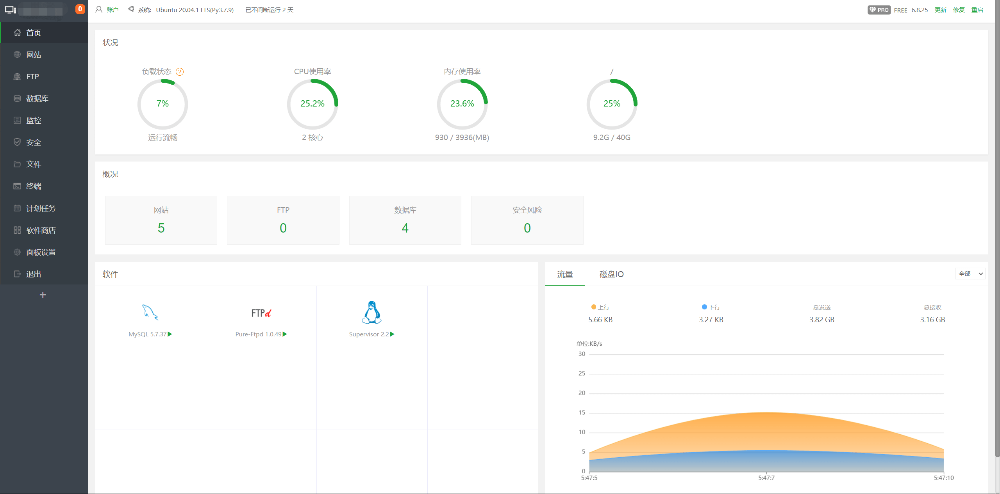

由于本人在使用宝塔国际版的时候没有清除数据就直接强制安装宝塔国内版导致账号被封，所以不得不找一个好用的面板，也就有了让我体验这么多管理面板的机会。

#### 国内的服务器管理面板有哪些？

宝塔面板、AMH、小皮面板、护卫神、appnode、旗鱼云梯、云帮手......

最后两个面板我并没有安装体验，所以本文不谈旗鱼云梯和云帮手

#### 先说小皮面板、护卫神以及 appnode

~~小皮面板~~

整体页面跟宝塔相似，但软件版本太低,并不止一个软件，而是很多软件版本都低
**pass**

~~护卫神~~

连反向代理功能都没有，我是用来部署 cloudreve，必须用反向代理
**pass**

~~appnode~~

已经停止运营,社区基本没有解答问题的人
**pass**

#### AMH 面板和宝塔面板比较（重点）

##### AMH 面板 —— 宝塔面板

##### 页面展示

**amh**
安装完成后 amh 首页
.png>)

**宝塔面板**

##### 对比

**amh**
整体页面风格给人一种复古的感觉（丑），我体验的是 6.xx 版本（但截图是最新版本），具体版本号忘了，7.0 版本已经更新，看着还不错，软件包基本都是最新版本，amh 面板以我这几天的体验更多的是一个单纯的可视化面板，包括网站数据库、反向代理甚至 ssl 证书都要手动安装软件并配置，在 AMH 面板最开始安装完成后只有必要的软件环境，不像宝塔很多功能默认都已经集成，不过好在功能齐全，在功能方面我的感受就是基本与宝塔持平，甚至更多，尤其备份功能非常强大，但是使用门槛要比宝塔更高一些

.png>)

不得不再说一下 amh 的备份功能真的很牛皮
.png>)

**宝塔**
在封我账户的第二天宝塔就暴雷了，有人说收集用户隐私，具体什么情况不得而知，我也不做过多评价，但不得不说的是宝塔确实试目前对于新手来说最简单好用的，更推荐宝塔国际版(aaPanel),最大的优点就是不需要绑定手机号，直接登录就可以，语言是英文，但外观和宝塔基本一致，不用担心不懂英文

#### 总结

**Ⅰ.** 国内的服务器面板，只要是我上面试过的，要么宝塔要么 AMH，其他的或多或少都有缺陷，直接 pass 就行，不用看百度的推荐，全 tm 采集的水文，坑全被我踩了（时间为 2022 年 6 月 4 日，我对我的评价负责，只要在这个日期之后不更新这个评论价就有效）
**Ⅱ.** 至于 amh 和宝塔两个面板其实功能方面以及第三方应用都是没有太大区别的，用哪个都可以，**宝塔**的话建议先用中文版体验一下，后续换成国际版 [aaPanel(需要魔法)](https://www.aapanel.com/new/index.html); **amh** 方面，非常稳定，不过需要注意的是大陆以外的服务器或者主机安装，一定要看安装小提示，不然有可能安装不上（概率很大，不过按照提示执行两条命令，基本上问题不大）
