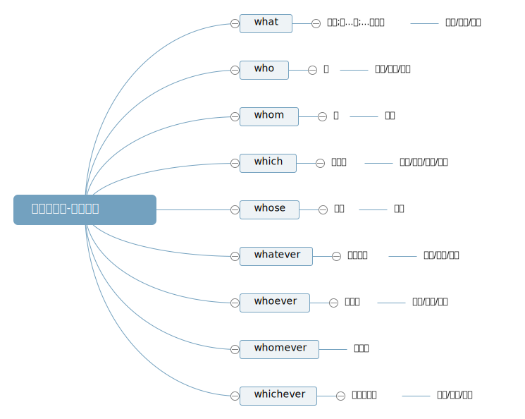
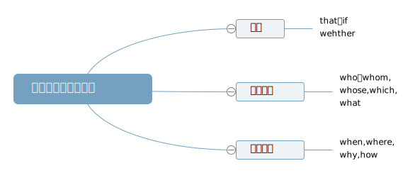

## 名词性从句

名词性从句包括:主语从句,表语从句,宾语从句,同位语从句

名词:表示人或事物名称的词

1. THe **book** is interesting.(主语)
   这本书很有趣
2. I belive his **words**.(宾语)
   我相信他的话
3. He is a **teacher**.(表语)
   他是一个老师
4. We **students** should study hard.(同位语)
   我们学生应该努力学习

名词性从句在功能上相当于名词

1. **His job** is important.
   **What he does** is important.
2. This is **his job**.
   This is **what he does**.
3. I don't like **his job**.
   I don't like **what he does**.
4. I don't know about the man,Mr.White.
   I don't know about the fact that he is Mr.White.
   **名词:** 在英语中主要充当四种成分:主语/宾语/表语和同位语
   **名词性从句的概念:**
   如果在本应该放名词的位置(主语/宾语/表语和同位语的位置)放了一个句子,我们就把这个句子叫做名词性从句.
   主语从句 宾语从句 表语从句 同位语从句

#### 1. 连词:that/ whether/ if

**①that**在名词性从句中不做成分,没有词义,一般不可以省略,在**宾语从句**中可以**省略**.(引导宾语从句时)

We know (that) the earth is round.

**②whether/if** 在名词性从句中表示"**是否**",**不做成分**,不可以省略.
但是:
A. **if**表示"是否" 只能用于**宾语从句**中
B. 当**宾语从句中作介词的宾语**时,表示"是否"只能用**whether**
C. 后接动词不定式或**or not**连用时,表示"是否"只能用**whether**

#### 2. 连接代词:what/ who/ whom/ which/ whose/ whatever/ whoever/ whomever/ whichever 等

在从句中充当**主/宾/表**等主干成分以及作定语,有词义,不可以省略

whatever 无论什么
whoever 无论谁
whichever 无论哪一个

**what**:什么;所...的;...的东西;在从句中作主语/宾语/表语
who: 谁;在从句中做主语/宾语/表语
whom: 谁;在从句中做宾语
which: 哪一个;在从句中做主语/宾语/表语/定语
whose: 谁的;在从句中作定语
whatever/whoever/whomever/whichever:在从句中做主语/宾语/表语

#### 3. 连接副词:when/ where/ why/how/ whenever/ wherever/ however

连接副词在从句中作**状语**,有词义,不可省略

**对句子进行断句并判断从句类型**

1. **What we learn** will help us to become better,more confident people.
   **主语从句**
   从句:What we learn

   第二个谓语动词:will help
   主语从句

   主句是一个句子，从句也是个句子，主句是句子需要有谓语动词，从句是句子，也需要有谓语动词

   what we learn 是从句，learn 是从句的谓语动词，那么 we 在从句的谓语动词前，we 一定是从句的主语，what 自然做的是从句的宾语，主谓宾

**what** :什么；所...的；...的东西；在从句中做**主语**、**宾语**、**表语**

2. It is important that we do not give up.
   **主语从句**
   我们不要放弃是重要的。
   That we do not give up is important.

#### 主语从句

1. **主语从句的结构**=主语从句+谓语动词

2. 为了避免头重脚轻，通常**it 作形式主语**，而把真正的主语从句放在句子后面

3. 常见的主语从句句型:

   1. It is + adj./n. +从句
      It is a pity/shame that... 遗憾的是...
      It is possible that... 很可能...
      It is impossible that... 不可能...
      It is no wonder that... 并不奇怪/无疑...
      It is clear that... 显然...

   2. It + Vi. + 从句
      It seems/appears that... 似乎...
      It happens that... 碰巧...
      It occurs to me that... 我突然想起...
   3. It + be done + 从句
      It is said that... 据说...
      It is reported that... 据报道...
      It is suggested that... 人们建议...

**对句子进行断句并判断从句类型**

1. I believe that we should never give up.
2. Don't worry about what he will do next.

#### 宾语从句

1. 宾语从句的结构= 主语 + vt. / 介词 + 宾语从句
2. that 引导的宾语从句在从句中不做成分，没有词义，可以省略.

**对句子进行断句并判断从句类型**

1. The trouble is that she has lost her money.
   麻烦的是她的钱已经丢了。
2. That was why whey used stone walls instead of f0............................................................ences.
   这就是为什么他们用石墙而不是栅栏。

#### 表语从句

表语从句的结构 = 主语 + 系动词+表语从句
