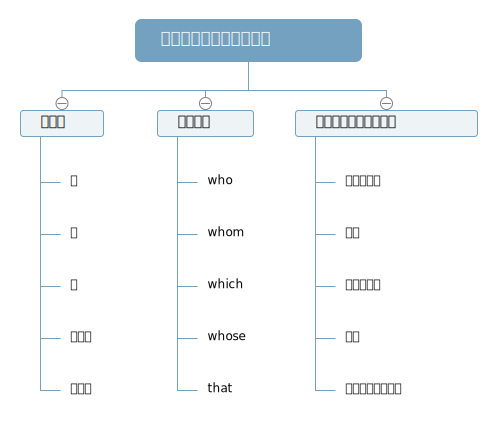

## 定语从句

**形容词修饰名词在句子中作定语**
**形容词修饰名词，副词修饰形容词动词**
**修饰限定名词的成分，通常形容词作定语**
a girl who has short hair
...she would give you evething that she had
**从位置关系上来讲，我们可以把形容词作定语称为前置定语，把定语从句成为后置定语**
She is a beautiful girl.
She is a girl who is beautiful.
She is a girl what is beautiful.
**关系词的选择是整个定语从句的重要考点.**

### 关系代词

**who** 
当先行词是人（或关系词）在从句中作主语或宾语的时候，我们需用关系代词who.（**作宾语时可以省略**）

**whom** 
当先行词是人且先行词或关系词在从句中作宾语的时候，我们可以选用关系代词whom.（**一般情况下可以省略**）

**which** 
当先行词是物且先行词在从句中做主语或宾语的时候我们可以选用关系代词which.（**作宾语时可以省略**）

**whose** 
当先行词是人或物，且先行词在从句中做定语的时候我们选用关系代词whose.

**that** 
当先行词是人或物都可以，且先行词再从句中作主语、宾语、表语时我们可以选用关系代词that.（**做宾语时一般可以省略**）

**非人即物**

The boy ___ is handsome is him.
解题思路:
___is handsome.这是从句.这个从句___这个位置缺什么？is是谓语，在谓语is前面缺少的成分一定是主语

#### that
**在定语从句中只能用that做关系词的情况**.

##### 1. 程:程度（多,少,所有,无...）
先行词是不定代词:
everything/anything/nothing/all/little...
或者先行词前有no/little/few/any/much...修饰的时候

That is **all that** I want.
There are **few** families **that** have no TVs in our country.

##### 2. 序:序数词
先行词前面有序数词修饰
first, second, third, forth...

You are the **first** man **that** I want to ask for help.

##### 3. 表:表语
关系代词在从句中作表语

He is not the man that he used to be.

(used to过去常常；be used to do被用来做某事；be used to doing习惯于做某事)
I used to live in Shijiazhuang.
我过去常常住在石家庄.
The pen is used to write.
这支笔被用于书写.
I am used to drinking some water after getting up.
我习惯于在起床之后喝些水.

##### 4. 问题:who/which引导的疑问句中（避免重复）

**Who** is the boy that is singing on the stage?（stage舞台）
那个正在舞台上唱歌的男孩是谁？
**Which** is the machine that we used last night?(machine机器)
哪个是昨天晚上我们用过的机器？

##### 5. 最:最高级，先行词前面有最高级修饰

You are the **most beautiful** girl that I have seen.
你是我见过的最美丽的女孩.

##### 6. 多:先行词及有人又有物

Let's talk about **the person and the things** **that** we can remember.
让我们谈谈我们能记住的人和事.

#### 定语从句中不能用 ***that*** 的情况
1. 非限制性定语从句中不能用that引导
   1. 起补充说明的作用，去掉不影响句子的整体意思
   2. 用","和主句隔开
   3. 不能由that引导
   It is an interesting book,which tells a love story.
   这是一本有趣的书，讲述了一个爱情故事.
   
   非限制性定语从句
2. **介词+关系代词**的情况，**介词**后的关系代词不能用that，只能用whom或which
   **介词后关系代词的选用:**
   1. 先行词是人---whom
   2. 先行词是物---which
   This is the **house** in **which** I ever lived.
   这是我曾经居住过的房子.
   He is the **man** with **whom** she was once in love.
   他是她曾经爱过的男人.

#### whose(谁的)
1. 先行词可以是人也可以是物
2. 在定语从句中作定语
3. 主句中的**先行词A**与从句中**关系词紧挨着的后面的名词**B是从属关系，中文标识"A的B"
（A是个名词，B也是个名词，当空格前后这两个名词有A的B这种表达时，我们选择关系代词whose）

The boy **whose** mother stands over there is our English teacher.
注:the boy's mother

The book **whose** cover is blue is my favorite.
注:the book's cover

在关系代词中既可以引导先行词是人又可以引导先行词是物的只有**that**和**whose**
关系代词的选择首先看选不选**whose**，换句话说看空格后面是不是**名词**，是名词的时候要先判断看起能不能有**A的B**的关系

### 关系副词

**when**

关系副词,表示时间
在定语从句中做时间状语
when = 介词+which

Then the moment came when you called her mama for the first time...

Then the moment came at which you called her mama for the first time...

(**一个句子之所以会变难就是因为加入了三种成分;第一是介词短语/第二是从句/第三就是非谓语动词**)

### 秘诀
作定语从句关系词的选择,终极区分合适选关系代词何时选关系副词的方法:把先行词带回到从句当中,看需不需要加介词,若需要加介词则从关系副词中三选一;若不需要加借此则从关系代词中五选一.

先看从句是否完整,如果完整直接从关系副词(**when where why**)中选择,如果不完整从关系代词(**that which whose who whom**)中选择

**介词选择**
1. 如果先行词为年/月---------------in
2. 如果先行词为星期或某一天----on
3. 如果先行词为某个时间点-------at

**测试**
I still remember the day (which/that/不填) I spend with my parents.

I still remember the day (when) I first met him.

#### where

关系副词,表示地点
在定语从句中做地点状语
where=介词+which
...your little bed where you were sleeping.
...your little bed on which you were sleeping,singing songs softly.

**on**在...上面（有接触）

This is the primary school where I used to study.
This is the primary school at which I used to study.
这是我曾经学习过的小学.
**study at school** 在学校学习(at为固定搭配)

#### why

关系副词
在定语从句中做原因状语
why=for+which
the reason why she did so.
the reason for which she did so.

There are several reasons why we can not stay too late at night.
There are several reasons for which we can not stay too late at night.
有几个原因,我们不能在晚上呆得太晚.
reason 原因

#### 定语从句的写法
**主句** Mary is **a model student**. 
1. 确认共从名词

**从句** **who** is often praised for her good work at school.

2. 确定主从句
3. 关系代词替代共同名词

attract=draw my attention
吸引我的注意
There are many paintings that draw my attention.

I like the boy who I met at the street corner yesterday.
我喜欢那个我昨天在街角遇见的男孩.

